# Claude-Nine Vision: Dev Team in a Box

## Overview

Claude-Nine is an AI-powered development organization simulator that models how real development teams work. It enables a single Director to manage multiple autonomous development teams, each working on different products with their own backlogs pulled from existing project management tools.

## The Hierarchy

```
Director (You)
├── Team 1 (Product A)
│   ├── Orchestrator (Engineering Manager)
│   ├── Monitor (Tech Lead/Architect)
│   └── Agents (Developers)
│       └── Work Queue → [PBI #4521, PBI #4522, PBI #4523...]
├── Team 2 (Product B)
│   ├── Orchestrator (Engineering Manager)
│   ├── Monitor (Tech Lead/Architect)
│   └── Agents (Developers)
│       └── Work Queue → [Story #123, Story #124...]
└── Team 3 (Product C)
    └── ...
```

### Roles

- **Director**: You - manages multiple teams, assigns work, monitors progress
- **Orchestrator**: Engineering Manager - coordinates agents, manages workflow
- **Monitor**: Tech Lead/Architect - detects conflicts, ensures code quality, manages merges
- **Agents**: Developers - write code, commit changes, work on specific tasks

## Core Philosophy: Integration First

Claude-Nine **does not replace** your existing project management tools. Instead, it **integrates** with them:

- ✅ Pull work items from Azure DevOps, Jira, GitHub Issues, Linear
- ✅ Display them in the Claude-Nine UI
- ✅ Assign work to teams
- ✅ Track progress in real-time
- ✅ Update status back to source systems
- ✅ Link to original artifacts for discussion

**Single Source of Truth**: Stories stay in ADO/Jira where product owners manage them. No duplicate entry, no sync issues.

## Use Case: Managing 5 Products

As a Director, you have 5 products under development:

1. **E-Commerce Platform** (12 PBIs in Sprint 24)
2. **Analytics Dashboard** (8 Stories in current sprint)
3. **Mobile App** (15 Issues in backlog)
4. **API Gateway** (6 Features to implement)
5. **Admin Portal** (10 PBIs queued)

### Traditional Approach
- Hire 5 development teams (15-25 people)
- Weekly standups with each team
- Context switching between products
- Manual coordination of dependencies
- Months of development time

### Claude-Nine Approach
1. Spin up 5 Claude-Nine teams
2. Connect each team to its product backlog (ADO query, Jira filter, etc.)
3. Let teams pull work and execute autonomously
4. Monitor progress from a single dashboard
5. Review and approve work in your existing PM tools

## Workflow Example: Azure DevOps Integration

```mermaid
sequenceDiagram
    Director->>Claude-Nine UI: Configure ADO connection
    Claude-Nine UI->>Azure DevOps: Pull PBIs from query
    Azure DevOps-->>Claude-Nine UI: Return 12 PBIs
    Director->>Claude-Nine UI: Assign PBI #4521 to E-Commerce Team
    Claude-Nine Team->>Azure DevOps: Update status: New → Active
    Claude-Nine Agents->>Git: Create branches, commit code
    Claude-Nine Monitor->>Git: Detect conflicts, manage merges
    Claude-Nine Team->>Azure DevOps: Update status: Active → Resolved
    Claude-Nine Team->>Azure DevOps: Comment: "PR ready for review"
    Director->>Azure DevOps: Review, comment, close PBI
```



### Step-by-Step

1. **Director configures ADO connection**
   - Organization: `acme-corp`
   - Project: `MyProject`
   - Query: `Sprint 24 - High Priority`
   - Auth: Personal Access Token (PAT)

2. **UI pulls PBIs from query**
   - Displays 12 work items already prioritized by product owner
   - Shows title, description, acceptance criteria, points

3. **Director assigns work to teams**
   - PBI #4521 "User Authentication with OAuth" → E-Commerce Team
   - PBI #4522 "Real-time Analytics" → Analytics Team
   - PBI #4523 "Push Notifications" → Mobile Team

4. **Teams execute autonomously**
   - Orchestrator breaks PBI into tasks
   - Assigns tasks to agents (developers)
   - Agents create branches, write code, commit
   - Monitor watches for conflicts

5. **Status updates flow back**
   - Team starts → ADO status: `New` → `Active`
   - PR ready → ADO comment: "Branch feature/oauth-login ready"
   - Work complete → ADO status: `Active` → `Resolved`

6. **Director reviews in ADO**
   - Clicks link to original PBI
   - Reviews code, asks questions, approves
   - Closes PBI in ADO

## What the Director Needs to See

### Global Overview Dashboard

```
╔══════════════════════════════════════════════════════════════╗
║ CLAUDE-NINE DIRECTOR DASHBOARD                               ║
╠══════════════════════════════════════════════════════════════╣
║ Active Teams: 5/8    Stories Completed Today: 23    ⚠️ 2     ║
╚══════════════════════════════════════════════════════════════╝

┌─────────────────────────────────────────────────────────────┐
│ TEAM: E-Commerce Platform       Product: ShopifyClone       │
│ Status: ✅ Active    Queue: 7 pending    Velocity: 4/day    │
│                                                              │
│ Current Work: PBI #4521 "User Authentication with OAuth"    │
│ Source: Azure DevOps - Sprint 24                            │
│ Progress: [████████░░░░░░] 60% (2/3 agents completed)       │
│                                                              │
│ 👷 Agents:                                                   │
│   • auth_agent    → feature/oauth-login  [Coding...]        │
│   • api_agent     → feature/api-auth     [Testing...]       │
│   • frontend_agent → feature/login-ui    [✓ Complete]       │
│                                                              │
│ 🏗️ Monitor: Checking for conflicts... [✓ Clean]            │
│                                                              │
│ 📋 Next in Queue (from ADO):                                │
│   1. PBI #4522 - Shopping cart functionality                │
│   2. PBI #4523 - Payment gateway integration                │
│   3. PBI #4524 - Order history page                         │
│                                                              │
│ [View in ADO ↗] [View Logs] [Pause Team] [Team Details]    │
└─────────────────────────────────────────────────────────────┘
```

### Key Metrics

1. **Team Status**
   - ✅ All agents working
   - ⚠️ Merge conflicts detected
   - ❌ Agent failed/crashed
   - ⏸️ Team paused

2. **Progress Indicators**
   - Current work item being executed
   - % complete (if estimable)
   - Queue depth (7 items pending)
   - Velocity (stories/day)

3. **Agent Activity**
   - What each agent is working on
   - Current branch/worktree
   - Last commit time
   - Status: Idle, Coding, Testing, Blocked

4. **Monitor/Architect Alerts**
   - Merge conflicts needing resolution
   - Code review status
   - Architecture concerns or blockers

5. **Work Queue** (Pulled from PM tool)
   - Linked to source system
   - Priority order from PM tool
   - Click through to original artifact

## Web UI Features

### For the Director

1. **Multi-Team Overview**
   - See all teams at once
   - Status of each team (active, idle, blocked)
   - Current work item per team
   - Queue depth and velocity

2. **Team Management**
   - Spin up new teams
   - Configure team composition (agents, roles)
   - Assign teams to products/repos
   - Pause/resume/shutdown teams

3. **Work Assignment**
   - View work items from connected PM tools
   - Drag-and-drop assignment to teams
   - Re-prioritize within team queues
   - Bulk assignment capabilities

4. **Real-Time Monitoring**
   - Live updates via WebSockets
   - Agent activity streams
   - Commit/merge notifications
   - Conflict alerts

5. **Integration Configuration**
   - Connect to Azure DevOps, Jira, GitHub
   - Configure queries/filters for work items
   - Set up status mapping
   - API key management

6. **Metrics & Analytics**
   - Team velocity over time
   - Work completion rates
   - Bottleneck identification
   - Resource utilization

### For Team Deep-Dive

When clicking into a specific team:

1. **Team Composition**
   - List of agents and their roles
   - Current task per agent
   - Agent status and health

2. **Current Work**
   - Full work item details (from PM tool)
   - Acceptance criteria
   - Progress breakdown by agent
   - Estimated completion

3. **Code Activity**
   - Recent commits
   - Active branches/worktrees
   - PR status
   - Code review state

4. **Monitor View**
   - Conflict detection results
   - Merge queue
   - Architecture decisions log
   - Quality gates

5. **Logs & Debugging**
   - Real-time log streaming
   - Agent conversation history
   - Error messages
   - Debug tools

## Technical Architecture

### Backend (FastAPI)

```
api/
├── routes/
│   ├── teams.py          # Team CRUD, start/stop
│   ├── agents.py         # Agent status, logs
│   ├── work_items.py     # Work queue management
│   └── integrations.py   # PM tool connectors
├── integrations/
│   ├── azure_devops.py   # ADO API client
│   ├── jira.py           # Jira API client
│   ├── github.py         # GitHub Issues client
│   └── linear.py         # Linear API client
├── models/
│   ├── team.py
│   ├── agent.py
│   └── work_item.py
└── websocket/
    └── events.py         # Real-time updates
```

### Frontend (Next.js + React)

```
dashboard/
├── app/
│   ├── (dashboard)/
│   │   ├── page.tsx           # Global overview
│   │   ├── teams/[id]/        # Team detail view
│   │   ├── work-queue/        # Work item management
│   │   └── settings/          # Integration config
│   └── api/                   # Next.js API routes
├── components/
│   ├── TeamCard.tsx
│   ├── AgentStatus.tsx
│   ├── WorkQueueList.tsx
│   └── MetricsChart.tsx
└── hooks/
    ├── useTeams.ts
    ├── useWorkItems.ts
    └── useWebSocket.ts
```

### Database Schema (SQLite/PostgreSQL)

```sql
-- Teams
CREATE TABLE teams (
  id UUID PRIMARY KEY,
  name VARCHAR NOT NULL,
  product VARCHAR NOT NULL,
  repo_path VARCHAR NOT NULL,
  status VARCHAR NOT NULL, -- active, paused, stopped
  created_at TIMESTAMP,
  updated_at TIMESTAMP
);

-- Agents
CREATE TABLE agents (
  id UUID PRIMARY KEY,
  team_id UUID REFERENCES teams(id),
  name VARCHAR NOT NULL,
  role VARCHAR NOT NULL,
  worktree_path VARCHAR,
  current_branch VARCHAR,
  status VARCHAR NOT NULL, -- idle, working, blocked
  last_activity TIMESTAMP
);

-- Work Items (synced from PM tools)
CREATE TABLE work_items (
  id UUID PRIMARY KEY,
  external_id VARCHAR NOT NULL, -- ADO PBI #, Jira ticket #
  source VARCHAR NOT NULL, -- azure_devops, jira, github
  team_id UUID REFERENCES teams(id),
  title VARCHAR NOT NULL,
  description TEXT,
  status VARCHAR NOT NULL,
  priority INTEGER,
  assigned_at TIMESTAMP,
  completed_at TIMESTAMP
);

-- Integration Configs
CREATE TABLE integrations (
  id UUID PRIMARY KEY,
  team_id UUID REFERENCES teams(id),
  type VARCHAR NOT NULL, -- azure_devops, jira, github
  config JSONB NOT NULL, -- API keys, queries, etc.
  created_at TIMESTAMP
);
```

### PM Tool Integrations

#### Azure DevOps
```python
class AzureDevOpsClient:
    def __init__(self, organization, project, pat_token):
        self.base_url = f"https://dev.azure.com/{organization}/{project}"
        self.headers = {"Authorization": f"Basic {pat_token}"}

    def get_work_items(self, query_id):
        """Pull work items from a saved query"""
        # WIQL query execution

    def update_status(self, work_item_id, new_state):
        """Update work item status"""

    def add_comment(self, work_item_id, comment):
        """Add comment to work item"""
```

#### Jira
```python
class JiraClient:
    def __init__(self, base_url, email, api_token):
        self.base_url = base_url
        self.auth = (email, api_token)

    def search_issues(self, jql):
        """Search using JQL query"""

    def transition_issue(self, issue_key, transition_id):
        """Move issue through workflow"""

    def add_comment(self, issue_key, comment):
        """Comment on issue"""
```

### Real-Time Updates (WebSocket)

```python
# Server-side event broadcasting
async def broadcast_agent_update(agent_id, status, activity):
    await websocket_manager.broadcast({
        "type": "agent_update",
        "agent_id": agent_id,
        "status": status,
        "activity": activity,
        "timestamp": datetime.utcnow()
    })

# Client-side subscription
const { data, error } = useWebSocket('/ws/teams/123', {
  onMessage: (event) => {
    if (event.type === 'agent_update') {
      updateAgentStatus(event.agent_id, event.status);
    }
  }
});
```

## Status Mapping

### Azure DevOps
```
Claude-Nine     →  ADO State
────────────────────────────
Queued          →  New
In Progress     →  Active
PR Ready        →  Resolved
Complete        →  Closed
Blocked         →  Active (+ comment with blocker details)
```

### Jira
```
Claude-Nine     →  Jira Status
────────────────────────────
Queued          →  To Do
In Progress     →  In Progress
PR Ready        →  In Review
Complete        →  Done
Blocked         →  Blocked
```

## Configuration Example

### Team Configuration (YAML)
```yaml
teams:
  - name: "E-Commerce Team"
    product: "ShopifyClone"
    repo_path: "/repos/shopify-clone"
    main_branch: "main"

    work_source:
      type: "azure_devops"
      organization: "acme-corp"
      project: "MyProject"
      query_id: "12345"  # Sprint 24 - E-Commerce
      pat_token: "${ADO_PAT}"
      poll_interval: 300  # Check for new work every 5 minutes

    agents:
      - name: "auth_agent"
        role: "Backend Developer"
        goal: "Implement authentication and authorization features"
        tools: ["git", "python", "database"]

      - name: "api_agent"
        role: "API Developer"
        goal: "Build and maintain REST APIs"
        tools: ["git", "python", "openapi"]

      - name: "frontend_agent"
        role: "Frontend Developer"
        goal: "Create responsive user interfaces"
        tools: ["git", "react", "typescript", "css"]

    monitor:
      check_interval: 60  # Check for conflicts every minute
      auto_merge: false   # Require manual approval for merges

  - name: "Analytics Team"
    product: "DataViz"
    repo_path: "/repos/analytics-dashboard"

    work_source:
      type: "jira"
      base_url: "https://acme.atlassian.net"
      email: "director@acme.com"
      api_token: "${JIRA_TOKEN}"
      jql: "project = ANALYTICS AND sprint in openSprints()"

    agents:
      - name: "viz_agent"
        role: "Visualization Developer"
        # ...
```

## Benefits

### For Directors
- **Single Pane of Glass**: Monitor all teams from one dashboard
- **No Context Switching**: Stay in familiar PM tools for refinement
- **Scalability**: Spin up teams on-demand
- **Transparency**: Real-time visibility into all development activity
- **Cost Effective**: AI agents vs. hiring multiple dev teams

### For Product Owners
- **Keep Existing Workflow**: Continue using ADO/Jira as usual
- **Automatic Updates**: No need to ask "what's the status?"
- **Traceability**: All work linked back to original artifacts
- **Collaboration**: Comment and refine in native tools

### For the Organization
- **Faster Time to Market**: Multiple products developed in parallel
- **Consistency**: All teams follow same patterns and practices
- **Quality**: Monitor agent ensures code quality and prevents conflicts
- **Documentation**: Work history preserved in PM tools

## Roadmap

### Phase 1: Core Platform
- [ ] Team orchestration engine
- [ ] Agent management and isolation (worktrees)
- [ ] Basic web UI for monitoring
- [ ] Azure DevOps integration

### Phase 2: Enhanced Monitoring
- [ ] Real-time WebSocket updates
- [ ] Detailed agent activity views
- [ ] Log streaming and debugging
- [ ] Metrics and analytics

### Phase 3: Additional Integrations
- [ ] Jira integration
- [ ] GitHub Issues integration
- [ ] Linear integration
- [ ] Slack/Teams notifications

### Phase 4: Advanced Features
- [ ] Multi-repository support
- [ ] Cross-team dependencies
- [ ] Custom agent templates
- [ ] AI-powered story breakdown
- [ ] Automated testing and deployment

## Getting Started

### Prerequisites
- Python 3.12+
- Node.js 18+
- Git
- Anthropic API key (for Claude AI)
- Optional: Azure DevOps, Jira, or GitHub account for work item integration
- Optional: PostgreSQL 14+ (SQLite included by default for local use)

### Quick Start

1. **Clone the repository**
   ```bash
   git clone https://github.com/your-org/claude-nine.git
   cd claude-nine
   ```

2. **Configure your first team**
   ```bash
   cp config.example.yaml config.yaml
   # Edit config.yaml with your team and ADO details
   ```

3. **Start the backend**
   ```bash
   cd api
   pip install -r requirements.txt
   uvicorn main:app --reload
   ```

4. **Start the dashboard**
   ```bash
   cd dashboard
   npm install
   npm run dev
   ```

5. **Open the dashboard**
   ```
   http://localhost:3000
   ```

6. **Spin up your first team**
   - Configure Azure DevOps connection
   - Create team with agents
   - Assign work items
   - Watch your AI dev team work!

## Conclusion

Claude-Nine reimagines software development by creating autonomous AI development teams that work like real teams - with managers, architects, and developers - all orchestrated from a single director's dashboard.

By integrating with your existing project management tools rather than replacing them, Claude-Nine fits seamlessly into your workflow while providing unprecedented visibility and control over multiple parallel development efforts.

**Welcome to the future of software development. Welcome to Claude-Nine.** 🚀
